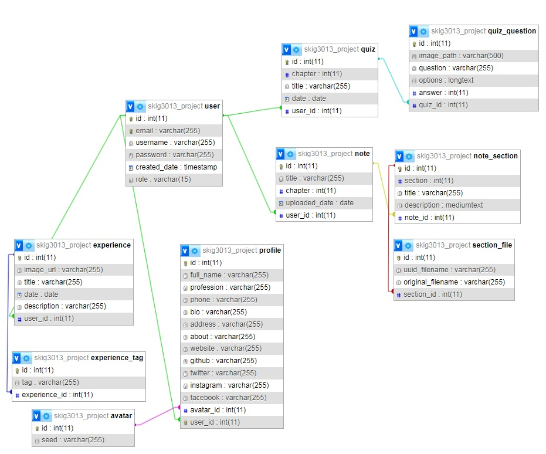

# Tiger
Silent Math Genius


## Setup Project

To setup the database, follows the below structure:



Or simply import the [secure_software.sql](skig3013_project.sql)

**_NOTE:_** The app config for database url should be changed according to your own database as follows:

```python
app.config['MYSQL_USER'] = 'your user name'
app.config['MYSQL_PASSWORD'] = 'your user password'
app.config['MYSQL_DB'] = 'your schema name'
```

## Run
To run it locally, please install [xampp](https://www.apachefriends.org/), and start Apache & MySQL modules

**_NOTE:_** Only the [main.py](main.py) file should be run
